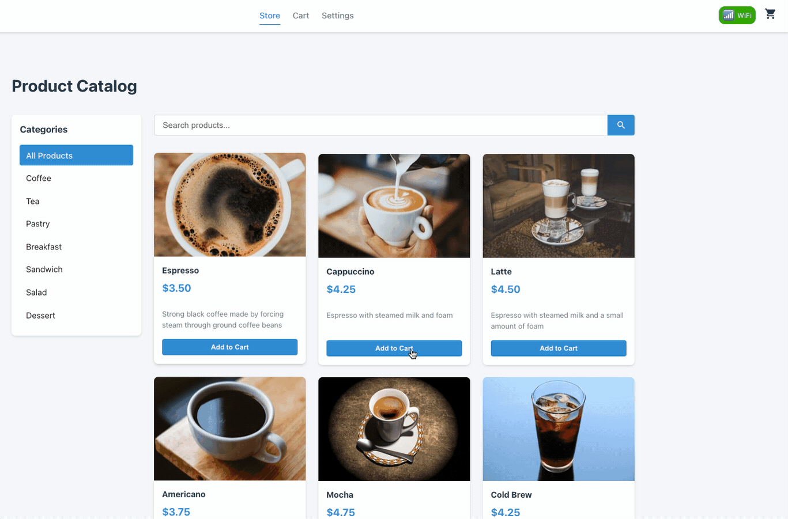

# POS PWA Project

This project is a Point of Sale (POS) Progressive Web Application with multiple connectivity options, including direct API access and Bluetooth connectivity through a bridge.



## Project Structure

```
pwa/
├── src/                 # Main React application
├── mock-api/            # Mock API server with SQLite database
├── mock-bt-bridge/      # Mock Bluetooth bridge (WebSockets)
├── raspberry_proxy/     # Raspberry Pi Bluetooth proxy (Python)
└── certs/               # SSL certificates for development
```

## System Architecture

```
┌──────────────────────────────────────────────────┐
│                  POS PWA (Browser)               │
│                                                  │
│  ┌─────────────┐    ┌───────────┐    ┌────────┐  │
│  │    React    │    │  Service  │    │  Cache │  │
│  │ Components  │───▶│  Worker   │───▶│ Manager│  │
│  └─────────────┘    └───────────┘    └────────┘  │
│           │                │                     │
└───────────┼────────────────┼─────────────────────┘
            │                │
            ▼                ▼
┌───────────────────┐  ┌────────────────────────┐
│  Direct HTTP(S)   │  │   Bluetooth Connection │
│    Connection     │  │                        │
└─────────┬─────────┘  └──────────┬─────────────┘
          │                       │
          ▼                       ▼
┌────────────────────┐  ┌─────────────────────┐
│     Mock API       │  │  Mock BT Bridge     │
│  (or real API)     │◀─┤  (or real device)   │
└────────────────────┘  └─────────────────────┘
```

## Available Scripts

### Main Application

In the project directory, you can run:

```bash
# Standard development mode (HTTP)
npm start

# Secure development mode (HTTPS)
npm run start:secure
```

### Mock API Server

In the mock-api directory:

```bash
# Start the API server (HTTP)
npm run dev

# Start the API server with HTTPS
npm run dev:secure

# Build the API server
npm run build

# Run the built API server
npm run start
```

The API server will be available at:
- HTTP: http://localhost:5000
- HTTPS: https://localhost:5000
- Swagger Documentation: http://localhost:5000/api-docs

### Mock Bluetooth Bridge

In the mock-bt-bridge directory:

```bash
# Start the BT bridge (WS)
npm run dev

# Start the BT bridge with secure WebSockets (WSS)
npm run dev:secure

# Build the BT bridge
npm run build

# Run the built BT bridge
npm run start
```

The Bluetooth Bridge will be available at:
- WS: ws://localhost:3030
- WSS: wss://localhost:3030

## Development Environment

You can run the complete development environment with:

```bash
# Start all services (HTTP/WS)
./scripts/run-dev-environment.sh

# Start all services with HTTPS/WSS
./scripts/run-dev-environment.sh secure
```

## API Documentation

The Mock API includes Swagger documentation available at `/api-docs` when the server is running. This provides interactive documentation for all available endpoints, including:

- Products API (`/api/products`)
- Categories API (`/api/categories`)
- Customers API (`/api/customers`)
- Orders API (`/api/orders`)

You can use the Swagger UI to explore the API and make test requests directly from your browser.

## Network Connectivity Options

The POS application supports three connectivity modes:

1. **WLAN**: Direct API access over HTTP(S)
2. **Bluetooth**: Connection via Bluetooth bridge to API
3. **Offline**: Cached data from service worker when no connection is available

The application automatically selects the best connectivity option based on availability.

## Bluetooth Connectivity

The application can connect to a Bluetooth device using the Web Bluetooth API. In development mode, a mock Bluetooth bridge is provided using WebSockets. In production, the application can connect to a real Bluetooth device (like a Raspberry Pi running the included proxy).

---

## Getting Started with Create React App

This project was bootstrapped with [Create React App](https://github.com/facebook/create-react-app).

## Available Scripts

In the project directory, you can run:

### `npm start`

Runs the app in the development mode.\
Open [http://localhost:3000](http://localhost:3000) to view it in the browser.

The page will reload if you make edits.\
You will also see any lint errors in the console.

### `npm test`

Launches the test runner in the interactive watch mode.\
See the section about [running tests](https://facebook.github.io/create-react-app/docs/running-tests) for more information.

### `npm run build`

Builds the app for production to the `build` folder.\
It correctly bundles React in production mode and optimizes the build for the best performance.

The build is minified and the filenames include the hashes.\
Your app is ready to be deployed!

See the section about [deployment](https://facebook.github.io/create-react-app/docs/deployment) for more information.

### `npm run eject`

**Note: this is a one-way operation. Once you `eject`, you can’t go back!**

If you aren’t satisfied with the build tool and configuration choices, you can `eject` at any time. This command will remove the single build dependency from your project.

Instead, it will copy all the configuration files and the transitive dependencies (webpack, Babel, ESLint, etc) right into your project so you have full control over them. All of the commands except `eject` will still work, but they will point to the copied scripts so you can tweak them. At this point you’re on your own.

You don’t have to ever use `eject`. The curated feature set is suitable for small and middle deployments, and you shouldn’t feel obligated to use this feature. However we understand that this tool wouldn’t be useful if you couldn’t customize it when you are ready for it.

## Learn More

You can learn more in the [Create React App documentation](https://facebook.github.io/create-react-app/docs/getting-started).

To learn React, check out the [React documentation](https://reactjs.org/).
